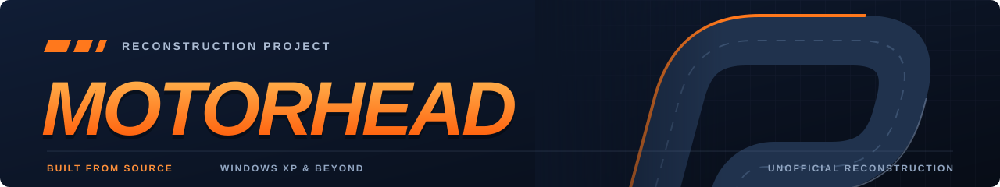
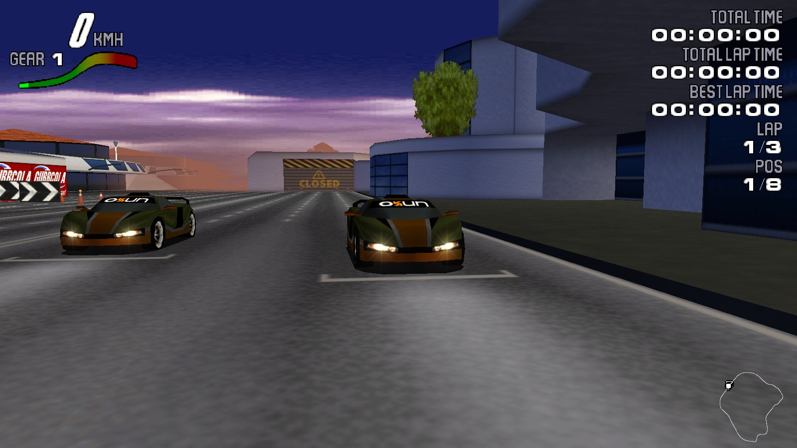
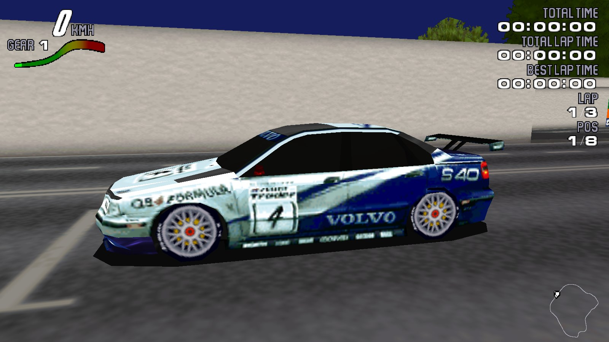
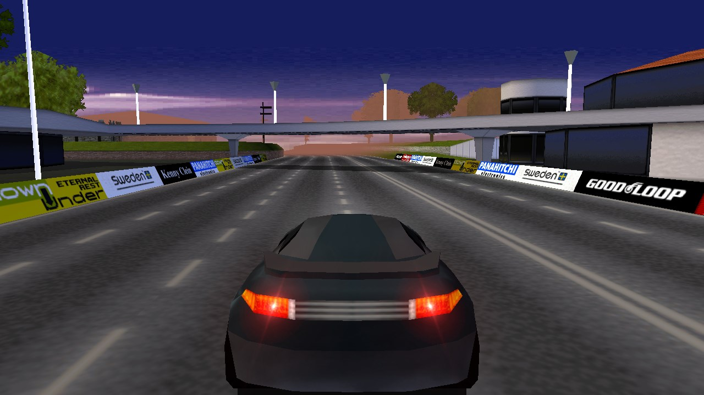
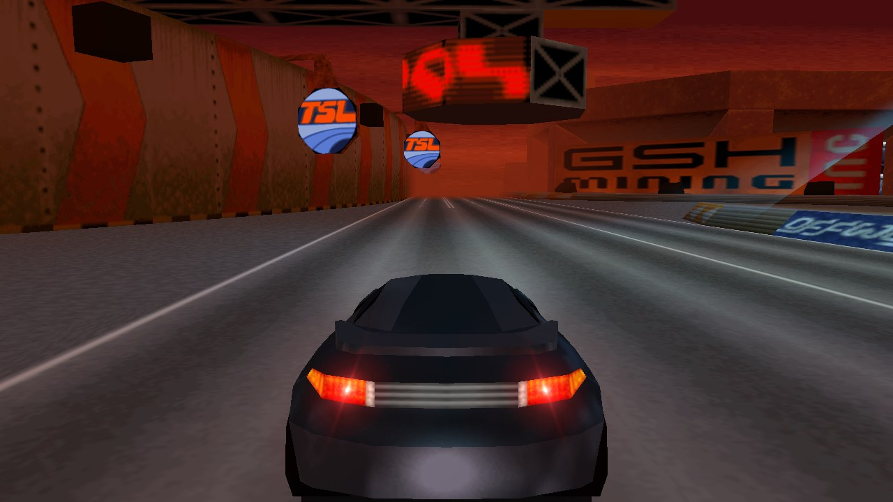
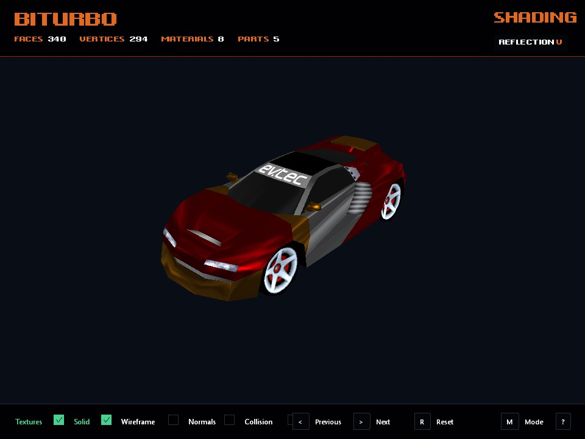
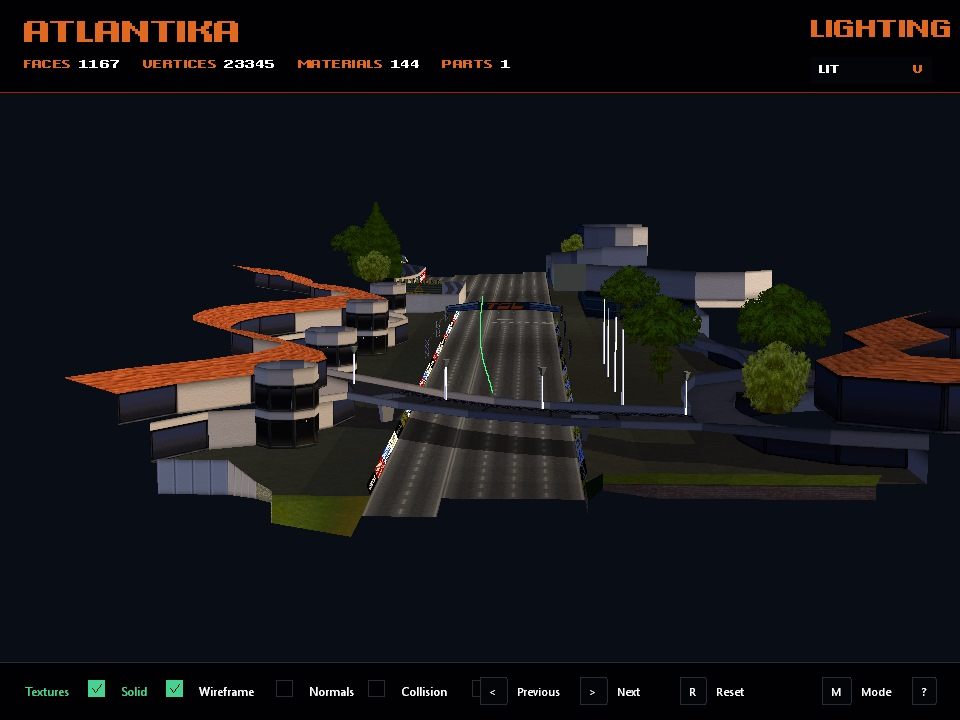

<p align="center">
  
</p>

<p align="center">
  Preserving the look and feel of Motorhead, from Windows XP to modern PCs.
</p>

<p align="center">
  <a href="#screenshots">Screenshots</a> ·
  <a href="#model-viewer">Model viewer</a> ·
  <a href="#features">Features</a> ·
  <a href="#build-from-source">Build</a> ·
  <a href="#installation">Install</a> ·
  <a href="#license">License</a>
</p>

An unofficial reconstruction of the original Motorhead for Windows. The aim is
to preserve its appearance and gameplay while improving compatibility,
display options, and usability on newer systems.

**Source-only distribution.** Build your own installer from this repository.
No prebuilt game executables or installers are provided. Original game media
and the official Motorhead 3.0 update are required to play.

## Screenshots

Captured directly from the reconstructed game using Direct3D 12.
The gallery includes replay views and the pre-race grid.

| Original cars | Optional S40 Racing content |
| :---: | :---: |
| [](docs/images/car-front.jpg) | [](docs/images/s40-front.jpg) |
| **Atlantika** | **Redrock** |
| [](docs/images/atlantika.jpg) | [](docs/images/redrock.jpg) |

## Model viewer

Inspect assembled cars and track geometry with textures and lighting. These
captures use the viewer's own renderer: reflection shading for the car and
applied track lighting for the circuit.

| BiTurbo add-on car | Atlantika section |
| :---: | :---: |
| [](docs/images/modelviewer-car.jpg) | [](docs/images/modelviewer-track.jpg) |

BiTurbo is a community add-on, shown for compatibility; the add-on pack is not included.

<a id="features"></a>


- Windows XP and newer support in a single game executable.
- Direct3D 9, Direct3D 11, Direct3D 12, Glide, and software rendering backends.
- Widescreen, fullscreen, and borderless windowed display modes.
- Selectable audio output devices and separate music/SFX levels.
- Optional S40 Racing content imported from your own media.
- Support for community add-on cars, without bundling the add-on packs.
- A separately buildable model viewer for inspecting game content.

Available renderers depend on your Windows version and hardware. Development
is ongoing; compatibility and performance can vary, especially on older PCs.

<a id="build-from-source"></a>


Use a **modern 64-bit Windows PC** to build. Windows XP is a game runtime
target, not a build environment. The scripts require `curl.exe`, Windows
PowerShell, and `certutil.exe` to be available.

1. Clone this repository with Git, or download and extract its ZIP.
2. Run `build-installer.bat` from the repository root.
3. Find your locally built installer at `bin/Installer.exe`.

From Git Bash:

```bash
git clone https://github.com/S95Sedan/motorhead.git
cd motorhead
./build-installer.bat
```

The batch file downloads pinned CMake, Ninja, and LLVM-MinGW tools into
`.tools/`, checks downloaded archives against their SHA-256 hashes, and builds
both the game and installer. An internet connection is required for the first
tool downloads; no separate compiler installation is needed.

To build the optional model viewer, run `build-modelviewer.bat`.
Its output is `bin/Modelviewer.exe`.

The viewer can browse the cars and tracks in an installed game folder. To
inspect a particular car, pass that folder and a relative CAR definition
(for example, `Game/car20.car`). Cars sharing a mesh remain separate entries.

<a id="installation"></a>


1. Run your locally built `bin/Installer.exe`.
2. Select your original Motorhead CD-ROM or supported CUE/BIN image, and the
   official Motorhead 3.0 update (`mhp30.exe`). Placing the media and update
   beside the installer makes them easier to locate.
3. Choose an installation folder and your soundtrack options. To import S40
   Racing content, also supply its supported disc image.
4. Launch `Motorhead.exe` from the installed game folder.

The game needs its installed data folders beside the executable; the build
output alone is not a complete playable installation. Original media, the
official update, and optional add-on packs are not distributed here.

<a id="credits"></a>


- **Digital Illusions** — original Motorhead game.
- **S95Sedan** — reconstruction project and maintenance.
- **OpenAI Codex** — AI-assisted development and documentation.

This is an unofficial project, not affiliated with or endorsed by the original
developers or publishers.

<a id="license"></a>


This project is **source-available for non-commercial use** under the
[Motorhead Non-Commercial License](LICENSE).
See the license for the full terms and restrictions on commercial use.

Original Motorhead and S40 Racing assets and trademarks belong to their
respective owners. Screenshots illustrate the game and do not relicense its
assets. Third-party components retain their own licenses.
